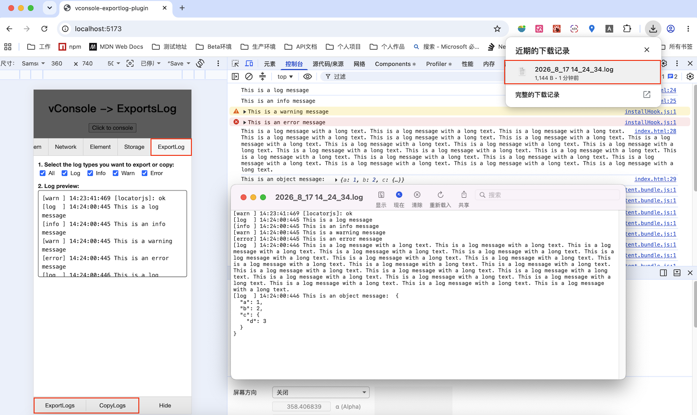

[English](./README.md) | 简体中文

# vconsole-exportlog-plugin

一个用于 [vConsole](https://github.com/Tencent/vConsole) 的插件，支持复制日志以及将日志导出为文件。

支持 vConsole v3.15.1。

---

## 功能特性

- 将日志复制到剪贴板
- 将日志导出为本地文件
- 在复制或导出前按日志类型进行筛选

## 安装

```bash
npm i vconsole-exportlog-plugin
```

## 使用

```ts
import VConsole from 'vconsole'
import VConsoleExportLogsPlugin from 'vconsole-exportlog-plugin'

const vConsole = new VConsole()
new VConsoleExportLogsPlugin(vConsole)
```

## 截图

> 复制日志并导出日志文件
> 

## 致谢

本项目在早期开发过程中参考了以下仓库，在此表示感谢：

- [vconsole-outputlog-plugin](https://github.com/sunlanda/vconsole-outputlog-plugin)
- [@liuxb001/vconsole-outputlog-plugin](https://github.com/liuxb-tofu/vconsole-outputlog-plugin)
